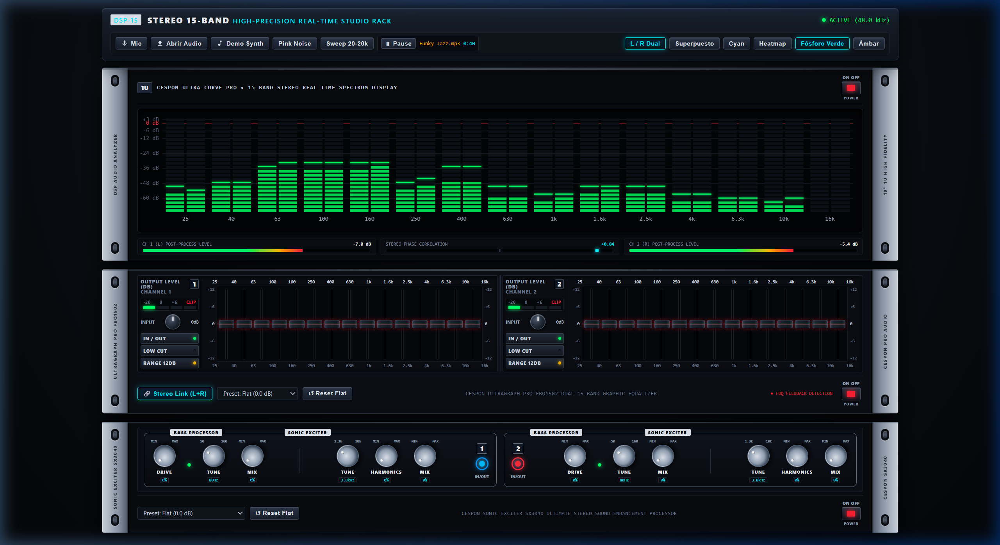

# SoundRack • 19" Professional Audio Studio Rack

[](https://developer.mozilla.org/en-US/docs/Web/API/Web_Audio_API)
[](https://developer.mozilla.org/en-US/docs/Web/API/Canvas_API)
[](#)
[](LICENSE)

**SoundRack** es un sistema modular de procesamiento y análisis espectrográfico de audio estéreo de alta fidelidad, diseñado con la estética realista de un **mueble de rack de estudio de 19 pulgadas (1U)**.

Toda la aplicación está autocontenida en un único archivo HTML sin dependencias externas, aprovechando al máximo la **Web Audio API** para ofrecer procesamiento DSP en tiempo real con latencia ultrabaja.

---

## Captura de Pantalla



---

## Componentes del Sistema

### 1. Consola de Controles Generales (Por Encima del Rack)
Panel superior flotante (`.studio-top-bar`) con controles globales del estudio:
- **Indicador de Sincronización DSP**: Frecuencia de muestreo activa en tiempo real (`48.0 kHz`) con LED verde de estado.
- **Selector de Fuentes de Audio**:
  - `Mic`: Entrada de micrófono estéreo de baja latencia.
  - `Abrir Audio`: Carga de archivos locales (MP3, WAV, FLAC, OGG, etc.) con soporte para *Drag & Drop*. Al cargar una pista, queda pausada en espera (`0:00`) sin auto-play, lista para iniciar con el botón `▶ Play`.
  - `Demo Synth`: Generador de sintetizador polifónico integrado con bombo analógico, caja/hi-hats estéreo y acordes arpegiados.
  - `Pink Noise`: Generador continuo de ruido rosa estéreo calibrado.
  - `Sweep 20-20k`: Barrido senoidal logarítmico calibrado de 20 Hz a 20.000 Hz.
  - *Pista de prueba*: El repositorio incluye el archivo `Funky Jazz.mp3` listo para probar inmediatamente la dinámica y respuesta del rack.
- **Selector de Modos y Paletas de Visualización**:
  - Modos: `L / R Dual` (canales izquierdo y derecho lado a lado) y `Superpuesto`.
  - Paletas cromáticas: **Fósforo Verde** (predeterminada con picos neón), **Cyan**, **Heatmap** y **Ámbar**.

---

### 2. Unidad 1 (Superior): Analizador Espectrográfico DSP-15 (1U)
Inspirado en analizadores de hardware de estudio profesional:
- **15 Bandas ISO Normalizadas (2/3 de octava)**:
  `25 Hz, 40 Hz, 63 Hz, 100 Hz, 160 Hz, 250 Hz, 400 Hz, 630 Hz, 1 kHz, 1.6 kHz, 2.5 kHz, 4 kHz, 6.3 kHz, 10 kHz, 16 kHz`.
- **Medición Post-Procesamiento**: Las barras reflejan fielmente los cambios introducidos por el ecualizador y el excitador armónico.
- **Indicadores de Retención de Pico (Peak Hold)**: En color verde fósforo neón con caída balística suave.
- **Medidores Auxiliares Integrados**:
  - Vúmetros de pico estéreo para Canal 1 (L) y Canal 2 (R) con escala en decibelios (dB).
  - Medidor de correlación de fase estéreo (-1.00 a +1.00) con punto seguidor en tiempo real.
- **Interruptor Basculante POWER Propio**:
  - **ON**: Muestra la medición activa en tiempo real.
  - **OFF (Standby)**: Apaga y oscurece la pantalla del analizador a reposo sin cortar la reproducción de audio.

---

### 3. Unidad 2 (Intermedia): Cespon ULTRAGRAPH PRO FBQ1502 (1U)
Ecualizador gráfico estéreo dual de 15 bandas de precisión:
- **Doble bloque simétrico (Channel 1 L & Channel 2 R)**:
  - 30 Faders deslizantes con el característico **LED rojo iluminado en la perilla** (estilo FBQ).
  - Potenciómetros rotativos `INPUT GAIN` (-15 dB a +15 dB).
  - Escalera LED de salida de 4 pasos por canal (`-20 dB`, `0 dB`, `+6 dB`, `CLIP`).
  - Filtros pasa-altos subgraves `LOW CUT` (25 Hz).
  - Conmutador de escala `RANGE` (±6 dB / ±12 dB).
  - Botón `IN / OUT` individual por canal.
- **🔗 Stereo Link (L+R)**: Permite sincronizar ambos canales para mover un fader y reflejarlo inmediatamente en el otro canal.
- **Menú de Presets**: *Flat (0.0 dB) por defecto*, *Rock Power*, *Club / Electronic*, *Bass Punch*, *Vocal Presence*, *Treble Air*, *V-Shape Smile*.
- **Interruptor Basculante POWER Propio (Hardware Bypass)**:
  - **ON**: El ecualizador procesa la señal a través de los 30 filtros biquad en cascada.
  - **OFF (Bypass Real)**: La señal evita completamente los filtros y viaja de forma 100% plana y transparente (0.0 dB) sin coloración. La carátula se atenúa visualmente.

---

### 4. Unidad 3 (Inferior): Cespon SONIC EXCITER SX3040 (1U)
Procesador definitivo de enriquecimiento y restauración sonora estéreo:
- **Arquitectura Analógica Dual con Filete Blanco Curvo**:
  - **BASS PROCESSOR**:
    - `DRIVE`: Ajusta la saturación no lineal y compresión de subgraves (`WaveShaperNode` con función $\tanh$).
    - `TUNE`: Frecuencia de corte seleccionable de 50 Hz a 160 Hz (`Q = 2.4`).
    - `MIX`: Porcentaje de graves enriquecidos inyectados a la mezcla.
    - **LED de presencia de graves**: Pulsa en verde al ritmo de la energía de los bombos y bajos.
  - **SONIC EXCITER**:
    - `TUNE`: Frecuencia de corte de agudos seleccionable de 1.3 kHz a 10 kHz (`Q = 1.8`).
    - `HARMONICS`: Generador dinámico de sobretonos armónicos pares e impares (segundo y tercer armónico para aportar aire, brillo y apertura estéreo).
    - `MIX`: Cantidad de armónicos excitados añadidos a la señal.
  - **Pulsadores Circulares `IN / OUT`**: Canal 1 con halo azul y Canal 2 con halo rojo para A/B testing rápido.
- **Menú de Presets**: *Flat (0.0 dB) por defecto*, *Studio Mastering Polish*, *Club / EDM Punch & Sizzle*, *Rock Power & Snare Crack*, *Vocal Air & Shimmer*, *Acoustic & Strings Sparkle*, *Sub-Bass Boom & Rumble*.
- **Interruptor Basculante POWER Propio (Hardware Bypass)**:
  - **ON**: Excita la señal con saturación de graves y brillo armónico.
  - **OFF (Bypass Real)**: Desconecta la saturación y armónicos agregados, dejando pasar la señal 100% limpia y seca.

---

## Diagrama de la Cadena de Audio DSP

```
[Fuentes: Mic / Archivo / Synth / Ruido] 
                   │
                   ▼
             [Master Gain]
                   │
                   ▼
         [Channel Splitter (L / R)]
                   │
    ┌───────────────┴───────────────┐
    ▼ (Canal Izquierdo)             ▼ (Canal Derecho)
 [Cespon SX3040 Exciter Ch 1]    [Cespon SX3040 Exciter Ch 2]
    │ (Bypass transparente)         │ (Bypass transparente)
    ▼                               ▼
 [Cespon FBQ1502 EQ Ch 1]        [Cespon FBQ1502 EQ Ch 2]
    │ (Bypass transparente)         │ (Bypass transparente)
    ▼                               ▼
 [Analizador Espectrográfico L]  [Analizador Espectrográfico R]
    │                               │
    └───────────────┬───────────────┘
                    ▼
         [Channel Merger (L + R)]
                    │
                    ▼
       [audioCtx.destination (Altavoces)]
```

---

## Cómo Ejecutar el Proyecto

No requiere Node.js, compilación ni instalación de paquetes.

### Opción 1: Abrir directamente en el navegador
Simplemente abre el archivo [index.html](index.html) con Google Chrome, Mozilla Firefox, Microsoft Edge o Safari.

### Opción 2: Mediante servidor HTTP local (Python)
Para habilitar la carga de archivos de audio locales y micrófono sin restricciones CORS de `file://`:
```bash
python -m http.server 8080
```
Luego abre en tu navegador:
```
http://localhost:8080/index.html
```

---

## Atajos y Controles
- **Interruptores POWER**: Clic en el interruptor o en su caja para activar/desactivar cada unidad (Bypass real en audio).
- **Arrastrar Faders / Knobs**: Clic y arrastrar verticalmente para ajustar niveles con suavidad.
- **Doble Clic en Faders**: Restablece el fader automáticamente a 0.0 dB.
- **Doble Clic en Knobs**: Restablece la perilla a su posición estándar por defecto.
- **Drag & Drop**: Arrastra cualquier archivo MP3 o WAV (como `Funky Jazz.mp3`) directamente sobre el rack para cargarlo en el reproductor.

---

## Licencia
Este proyecto está bajo la Licencia MIT.
